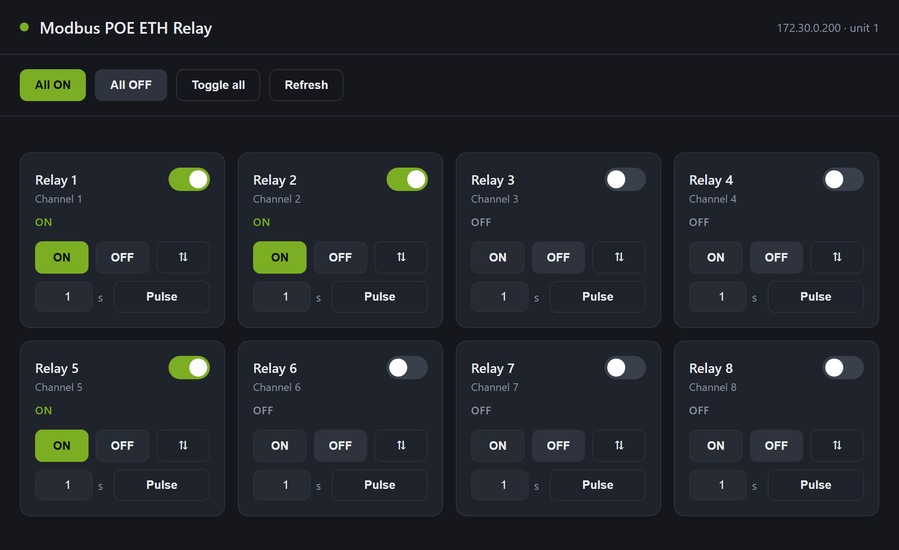

# Conversational Synthesis of an Operational Device-Control Application: A Case Study and a Proposed Specification Pattern for Domain-Expert–Driven Code Generation

**Author:** A. McLeod
**Development assistant:** Claude (Anthropic), Claude Code
**Artifact:** `waveshare-relay-web` — <https://github.com/amcleodUNH/waveshare-relay-web>

---

## Abstract

We report a case study in which a complete, operational software artifact—a
zero-dependency web control panel for an eight-channel Waveshare *Modbus POE ETH
Relay* board—was produced entirely through natural-language interaction with a
large language model (LLM) coding agent, without the human author writing source
code. The work was driven by a domain practitioner whose expertise lay in the
target device and its field of use (relay control for an uncrewed surface
vehicle, USV) rather than in software engineering. We describe the resulting
system and its non-obvious technical core: the board exposes a Modbus-RTU framing
over TCP rather than standard Modbus-TCP, a distinction that defeats off-the-shelf
clients and that the agent resolved by empirical protocol probing. We then analyze
the eleven-turn interaction that produced the artifact, classifying each user
utterance by communicative function, and ask a counterfactual question: which of
the iterative corrections could have been eliminated by a better-formed initial
request, and which were irreducible? From this analysis we abstract a proposed
specification pattern—the *Domain-Expert Specification (DES) schema*—intended to
help practitioners with deep device and field knowledge but limited coding
experience elicit a correct artifact in fewer passes. We present the schema, a
worked single-pass reconstruction of the present project, and a discussion of the
pattern's limits. We additionally estimate development effort: the AI-coupled
interaction yielded the tested, published artifact in on the order of one hour of
active effort, against a three-point (PERT) estimate of roughly 25 person-hours
(≈20–30 h) for an unaided professional developer—and a qualitatively larger or
infeasible burden for the domain practitioner working alone. This is a single-case,
observational study; the proposed pattern is a hypothesis for future evaluation, not
a validated method, and the duration figures are an instrumented bound against a
modeled estimate rather than a controlled measurement.

**Keywords:** code generation, large language models, human–AI interaction,
requirements specification, Modbus, industrial control, end-user programming.

---

## 1. Introduction

The capacity of LLM-based coding agents to translate natural-language intent into
working software shifts a long-standing bottleneck in instrumentation and control
work. Domain practitioners—field engineers, marine technicians, laboratory
scientists—frequently understand a device and its operational context far better
than any available programmer, yet cannot themselves implement the software glue
that makes the device usable. The conventional remedy, mediated software
development, introduces latency, cost, and a translation gap between domain intent
and code.

This paper examines one instance of the alternative: a practitioner specifying an
operational tool conversationally and an LLM agent producing, debugging,
hardening, packaging, and publishing it. Our contribution is twofold. First, we
document the artifact and the engineering decisions of substance, in particular
the device's deviation from the nominal Modbus-TCP standard. Second, and more
generally, we treat the interaction transcript itself as data: we classify the
practitioner's inputs, distinguish corrections that were *specification-avoidable*
from those that were *irreducible*, and propose a reusable request structure for
this class of user.

---

## 2. Background: the device and its protocol

The Waveshare *Modbus POE ETH Relay* is an eight-channel relay board with
Power-over-Ethernet and an RJ45 interface. It is marketed as Modbus-capable and
listens on TCP port 502, the registered Modbus port. A reasonable first assumption
is therefore that it implements **Modbus-TCP**, in which a request is prefixed by a
seven-byte MBAP (Modbus Application Protocol) header and the trailing CRC of the
serial protocols is omitted.

Empirical probing during development falsified this assumption. Standard
Modbus-TCP requests to port 502 connected at the socket layer but elicited no
application response; reads timed out across candidate unit identifiers. Sending
instead a raw **Modbus-RTU** frame—`address, function, data…, CRC16`, the framing
native to RS-485 serial links—produced immediate, correct replies. The board is, in
effect, a transparent Ethernet-to-Modbus-RTU bridge: it forwards the socket's bytes
to its internal RTU engine unchanged. The following exchanges were observed (CRC
bytes elided):

- `01 01 00 00 00 08` (FC 0x01, Read Coils, eight coils from 0x0000) → a one-byte
  coil bitmap, confirming eight channels, all de-energized.
- `01 03 40 00 00 01` (FC 0x03, Read Holding Register 0x4000) → `00 01`, the board's
  configured Modbus unit address (1).

Control is effected with FC 0x05 (Write Single Coil): value `0xFF00` energizes,
`0x0000` de-energizes, and the vendor-specific `0x5500` toggles; coil address
`0x00FF` addresses all channels simultaneously. These primitives, wrapped in RTU
framing over a TCP socket, constitute the entire control surface the artifact
requires.

This protocol detail is the project's principal piece of non-obvious engineering
knowledge. It is also instructive for the present study: it could not have been
supplied by the practitioner in advance (it is undocumented in the user's mental
model of the device) and could not have been guessed correctly by the agent from
the device name alone. It was *discovered*, and discovery of this kind is a
capability that no improvement in prompt formulation can substitute for.

---

## 3. System architecture

The artifact is a single Python file (`relay_control.py`) depending only on the
standard library, a deliberate choice that minimizes deployment friction on a field
or embedded host. It comprises two layers:

1. **A Modbus-RTU-over-TCP client.** A CRC-16 implementation, frame construction
   for the read and write function codes, and a transaction routine. In its final
   form (see §4, turn 10) the client maintains a single persistent, lock-guarded
   socket and reads replies by length-framing them per function code, so that a
   reused stream cannot desynchronize.

2. **A web layer.** A `ThreadingHTTPServer` serves a server-rendered control page
   and a small JSON API (`GET /api/status`, `POST /api/control`). The page presents
   one card per channel with on/off/toggle controls, a live switch, a momentary
   pulse control, and global all-channel actions; it polls status every two seconds
   and displays a connection indicator (Figure 1).

*Figure 1. The generated control panel rendering a mixed channel state.*

---

## 4. Iterative development: the interaction as method

The artifact was produced over eleven user turns. Table 1 reproduces each input in
condensed form and classifies it by communicative function. We distinguish:
*specification* (states a requirement), *authorization* (grants permission),
*defect report* (identifies a fault), *feature* (adds scope), *packaging*
(distribution/structure), *deferral* (marks a parameter as later-bound),
*context* (supplies domain framing), and *constraint* (bounds how work is done).

**Table 1. The development interaction, by turn.**

| # | User input (condensed) | Function | Elicited |
|---|------------------------|----------|----------|
| 1 | Waveshare Modbus POE ETH relay at 172.30.0.200, password "admin"; build a script for operational control via a custom webpage | Specification | Initial system; protocol discovery |
| 2 | The device is unconnected; relays may be activated for testing | Authorization | Live switching verification |
| 3 | The provided web GUI does not operate the relay board | Defect report | Diagnosis and fix of a front-end fault |
| 4 | Add the momentary-pulse buttons to the cards | Feature | Per-channel pulse control |
| 5 | Create this as a new project on my GitHub account and prepare for publishing | Packaging | Repository, README, license, push |
| 6 | "Do both" (accept proposed cleanup and security hardening) | Packaging | Loopback default; tree cleanup |
| 7 | Channel labels will be changed later during install/testing on the USV | Deferral + Context | Placeholder labels; USV framing |
| 8 | This should be a separate project from Starlink; move it parallel and isolate it | Packaging (structural) | Sibling directory; isolated memory |
| 9 | Add a GUI graphic to the GitHub project | Packaging (docs) | Rendered screenshot asset |
| 10 | Do this (a reliability refactor) without connection to the board | Constraint + Reliability | Persistent-connection client; hardware-free verification |
| 11 | Write this paper | Meta | The present document |

Two turns merit technical comment because they expose the difference between
defects of *specification* and defects of *implementation or knowledge*.

**Turn 3 (defect report).** The first web interface rendered but did not actuate
relays. Diagnosis revealed an implementation fault entirely internal to the
generation process: the page built its controls with inline `onclick` handlers
assembled by JavaScript string concatenation, embedded in a Python triple-quoted
string. Python collapsed the backslash-escaped quotes, yielding a JavaScript syntax
error that disabled the entire script. The remedy was to render the cards
server-side and dispatch events by `data-` attribute delegation. No conceivable
phrasing of the user's request could have prevented this fault; it was a latent bug
in the generated code, and the user's terse, accurate defect report ("does not
operate the relay board") was sufficient to trigger correction.

**Turn 10 (reliability under constraint).** During screenshot capture the board
became wholly unresponsive—it ceased answering ICMP—after a burst of overlapping
connections from the two-second status poller, manual test commands, and direct
reads. The root cause was architectural: the client opened and closed a fresh TCP
socket per transaction, and these bridges maintain a very small connection pool that
rapid connect/close churn can exhaust, wedging the device until power-cycled. The
user directed a refactor *without a connected board*. The agent rewrote the client
to use a single persistent socket and verified it against a synthetic Modbus server
that emulated the board's coils and connection semantics, confirming connection
reuse (one connection across all operations), transparent reconnection after a
dropped link, and correctness under eight-thread concurrency. This turn is notable
in two respects: the reliability requirement *emerged* from operational stress
rather than from foresight, and verification was achieved by substituting a
software model for absent hardware.

---

## 5. User-input analysis: toward single-pass specification

We now address the paper's central question. Of the eleven turns, several were
genuinely generative or irreducible, while others were corrective in ways that a
more complete initial specification could have pre-empted.

**Irreducible turns.** Turn 1 (the seed specification) and turn 11 (this paper) are
definitionally required. Turn 3's defect was an implementation bug, not a missing
requirement; it could be elicited only after the artifact existed and was observed.
The protocol discovery underlying turn 1 was likewise irreducible: it depended on
runtime evidence the user did not possess.

**Specification-avoidable turns.** Turns 4, 5, 6, 8, 9, and arguably 10 each
supplied a requirement that *existed in the user's intent from the outset* but was
surfaced only when the absence became visible:

- The momentary pulse (turn 4) is a standard relay operation for a USV (e.g.,
  pulsing a latching actuator or a reset line); its omission from turn 1 was an
  under-specification of the operational repertoire.
- Distribution as an isolated, published, documented repository (turns 5, 8, 9) was
  the user's destination throughout; the initial request named only "a script."
- Field reliability against connection exhaustion (turn 10) is implied by the
  deployment target—an unattended vehicle—and could have been stated as a
  non-functional requirement up front.

**A single-pass reconstruction.** Folding the realized intent back into the seed
request yields a specification that, modulo the irreducible protocol discovery and
the chance implementation bug, could have produced substantially the final artifact
in one pass:

> *Build a standalone, publishable tool to operate a Waveshare Modbus POE ETH Relay
> (8-channel) at 172.30.0.200 over Ethernet. The device is on the bench and
> unconnected, so you may switch relays to verify. I am not a programmer; deliver a
> single self-contained program I can run with minimal setup, plus a browser
> control panel exposing, per channel, on/off, toggle, and a momentary pulse of
> configurable duration, and global all-on/all-off. The board is destined for an
> uncrewed surface vehicle, so it must tolerate an unreliable, long-lived network
> connection without wedging the device. Channel names are unknown until install;
> leave them as editable placeholders. Verify behavior; where hardware is
> unavailable, verify against a model. Package it as its own public GitHub
> repository with a README, an open-source license, and a screenshot, kept separate
> from my other projects.*

This reconstruction is not offered as a reproach to the original interaction—
incremental discovery of one's own requirements is normal and often efficient—but
as evidence that a sizable fraction of the turns were *latent in the first intent*
and therefore, in principle, hoistable.

---

## 6. A proposed pattern: the Domain-Expert Specification (DES) schema

Generalizing from §5, we propose a lightweight schema for practitioners who know a
device and its field use but not programming. The schema's premise is that such
users reliably possess exactly the information that LLM agents most need and most
often lack, and that prompting them for it explicitly converts tacit knowledge into
specification. The schema comprises seven slots:

1. **Device & interface.** The hardware, its addressing, and how it is reached
   (here: a named board, an IP, an Ethernet/PoE link). *Users know this precisely;
   it anchors the agent and bounds protocol discovery.*
2. **Operational repertoire.** Every action the user expects to perform, in field
   terms (on/off, toggle, momentary pulse, all-channels). *This is the slot whose
   under-population caused turn 4; domain users can enumerate it exhaustively because
   it mirrors their physical workflow.*
3. **Field context & deployment.** Where and how the artifact will live (a bench
   tool vs. an unattended vehicle). *This slot licenses non-functional requirements;
   "uncrewed surface vehicle" implies the reliability requirement of turn 10.*
4. **Authorization & safety envelope.** What the agent may do to verify, and what it
   must not (here: relays may be switched because nothing is connected). *Explicit
   authorization unblocks empirical verification, which is otherwise withheld for
   safety.*
5. **Deferred parameters.** Values not yet known and to be left configurable (channel
   labels, finalized at install). *Naming deferrals prevents premature, wrong
   commitments and avoids a later correction.*
6. **Deliverable & distribution.** The desired form and destination (a single
   runnable program; a separate, public, documented repository). *This slot, stated
   first, collapses turns 5, 8, and 9 into the initial pass.*
7. **Verification expectation.** The standard of evidence required, including the
   fallback when hardware is absent (verify live; otherwise verify against a model).
   *This converts "make it work" into a checkable obligation and legitimizes
   model-based testing.*

The user need not write code, nor know Modbus from MQTT; the schema asks only for
what the practitioner already holds. Crucially, the schema does **not** attempt to
specify implementation. It deliberately omits how the protocol should be framed,
how the UI should be built, or how concurrency should be handled—precisely the
matters (turns 1 and 3) that belong to the agent and to discovery.

A reusable template follows.

> **Device & interface:** _<what it is, address, how reached>_
> **I need to:** _<every action, in field terms>_
> **It will be used:** _<where/how it is deployed; reliability or environmental
> demands>_
> **You may, to test:** _<permitted verification actions and prohibitions>_
> **Not yet known (leave configurable):** _<deferred parameters>_
> **Deliver as:** _<form, packaging, where it should live, docs/license>_
> **Verify by:** _<evidence required; fallback when hardware is absent>_
> **About me:** _<relevant non-coding expertise; coding experience>_

---

## 7. Development duration: measured AI-coupled effort versus an estimated unaided baseline

A question this study can partly address is how the *duration* of conversational,
AI-coupled synthesis compares with conventional, unaided human development of the
same artifact. We treat duration as **effort** (person-hours) rather than calendar
time: the project's wall-clock span covered several days, but that span was
dominated by idle intervals between the practitioner's availability and review, not
by generation work, and an unaided developer's calendar time would be similarly
punctuated. Effort is the comparable quantity.

### 7.1 Method

For the AI-coupled condition we bound active effort from the interaction record. The
artifact was produced and revised through eleven short user turns and the agent's
bounded responses; version-control timestamps show successive increments landing
minutes apart (the initial build and its security-hardening revision six minutes
apart; the screenshot and persistent-connection revisions eleven minutes apart).
Active effort—agent generation plus the practitioner's reading and direction—is
therefore on the order of one hour. We report this as an order-of-magnitude figure:
the interaction was not instrumented for precise timing, and we deliberately round
up to avoid understating the human-side cost of reviewing the agent's output.

For the unaided condition we cannot measure—no parallel human build was
performed—so we *estimate* it probabilistically. We decompose the artifact into
eight work components and assign each a three-point (optimistic *a*, most-likely
*m*, pessimistic *b*) effort estimate, then apply the PERT approximation: expected
effort *t*ₑ = (*a* + 4*m* + *b*)/6 with standard deviation *σ* = (*b* − *a*)/6,
treating components as independent so that the total variance is the sum of
component variances. The estimates assume a *competent professional developer*—a
generous baseline, since the practitioner who actually directed the work
self-identifies as a non-programmer (we return to this below). Scope is matched to
the delivered artifact: the components include protocol discovery, testing,
reliability hardening, and packaging, not merely the happy-path code.

### 7.2 Result

**Table 2. Three-point (PERT) effort estimate for an unaided professional build.**
All values in person-hours.

| Work component | *a* | *m* | *b* | *t*ₑ | *σ* |
|----------------|----:|----:|----:|-----:|----:|
| Protocol discovery (identify RTU-over-TCP, unit ID, function codes) | 1.0 | 3.0 | 10.0 | 3.83 | 1.50 |
| Modbus client (CRC-16, frame build, transaction, decode) | 1.0 | 2.5 | 6.0 | 2.83 | 0.83 |
| Web server + JSON API (stdlib `http.server`) | 1.0 | 2.0 | 5.0 | 2.33 | 0.67 |
| Front-end UI (HTML/CSS/JS, cards, polling, pulse) | 2.0 | 4.0 | 9.0 | 4.50 | 1.17 |
| Integration debugging | 1.0 | 3.0 | 8.0 | 3.50 | 1.17 |
| Reliability hardening (persistent connection, framing, reconnect) | 1.0 | 3.0 | 8.0 | 3.50 | 1.17 |
| Testing + hardware-free mock server | 1.0 | 2.5 | 6.0 | 2.83 | 0.83 |
| Packaging & publishing (repo, README, license, screenshot) | 0.5 | 1.5 | 4.0 | 1.75 | 0.58 |
| **Total** | | | | **25.1** | **2.9** |

The components sum to an expected **25.1 person-hours** with a standard deviation of
**2.9 h** (the total *σ* is the root-sum-square of the component values); a normal
approximation gives a 90% interval of roughly **20–30 hours**, about three working
days. The single largest and most uncertain component is protocol discovery: the
unaided developer, lacking the agent's rapid probing loop, must independently
determine that the board speaks Modbus-RTU-over-TCP rather than Modbus-TCP—the same
fact the agent established empirically in §2.

### 7.3 Comparison

Against this baseline, the AI-coupled condition produced a tested, hardened, and
published artifact in roughly one hour of active effort—an effort reduction on the
order of **20–30×** relative to an unaided professional. The comparison is starker,
though less quantifiable, against the practitioner's *actual* alternative. The human
author is not a professional developer; for them, unaided construction is not merely
25 hours but a qualitatively different regime requiring the prior acquisition of
socket programming, Modbus framing, concurrency, and front-end skills. The realistic
outcomes in that regime are a multiple of the professional estimate, or
non-completion—an outcome with nonzero probability that a point estimate of
person-hours does not capture. The operative comparison for this user is therefore
not "one hour versus twenty-five" but "a working tool versus, plausibly, none."

### 7.4 Threats to validity

The AI-coupled figure is an uninstrumented order-of-magnitude bound; the unaided
figure is a modeled estimate, not a measurement, and three-point estimates are known
to be sensitive to anchoring by the estimator. Both rest on n = 1. The professional
baseline may be conservative or generous depending on the developer's prior
familiarity with Modbus and with this board's non-standard framing; we widened the
pessimistic protocol-discovery bound to partly absorb that uncertainty. Most
importantly, effort ratios from a single small artifact should not be extrapolated
to larger systems, where coordination, architecture, and long-term maintenance
costs—less amenable to conversational synthesis—come to dominate. The figures
characterize this class of small, single-purpose instrumentation tools, where the
method appears most advantageous.

---

## 8. Discussion

The case suggests a division of labor that the DES schema is designed to formalize.
The practitioner supplies *what* and *why*—device, repertoire, context,
authorization, deliverable, evidence standard—drawn from field expertise. The agent
supplies *how*—protocol framing, interface construction, concurrency and reliability
engineering—and, importantly, *discovery* of facts available only at runtime. The
two corrective turns that no specification could have eliminated (the protocol
identity and the front-end bug) fall squarely on the agent's side of this line,
which is consistent with the schema's refusal to ask users to specify
implementation.

Three caveats temper the proposal. First, this is a single observational case with
n = 1, no control condition, and an agent-and-user pair that cannot be assumed
representative; the schema is a hypothesis, and its claimed reduction in passes is
untested. Second, some apparent under-specifications may be rational: incremental
elicitation lets a user defer decisions until an artifact makes the trade-offs
concrete (the user could not easily have judged the need for a persistent-connection
design before observing the board wedge). A schema that front-loads every decision
risks demanding commitments the user is not yet equipped to make. Third, the schema
assumes an agent capable of empirical discovery and model-based verification;
against a less capable system, slots 4 and 7 would yield less.

Future work should evaluate the schema comparatively—paired tasks with and without
the structured prompt, across multiple domain users and devices—measuring turns to
acceptance, defect counts, instrumented development time against matched unaided
controls, and the share of corrections attributable to specification gaps versus
implementation faults.

---

## 9. Conclusion

A field practitioner produced, debugged, hardened, and published an operational
device-control application by conversation alone, exercising domain knowledge rather
than programming skill. The interaction compressed development effort by roughly an
order of magnitude relative to an estimated unaided professional baseline (§7) and,
for a non-programmer, plausibly made the difference between a working tool and none.
Examining the interaction, we found that roughly half of its
turns supplied requirements latent in the original intent and therefore hoistable
into a single pass, while a minority—runtime protocol discovery and a generated
defect—were irreducible and properly the agent's responsibility. We abstracted the
hoistable content into the Domain-Expert Specification schema, a seven-slot prompt
structure that asks practitioners only for what their expertise already supplies and
withholds implementation detail from them by design. We offer it as a testable
pattern for making domain experts effective directors of code-generating agents,
and the present artifact as an existence proof that the division of labor it
encodes is workable.

---

### Materials and reproducibility

The complete artifact, including the persistent-connection client, the web layer,
and the figure reproduced here, is available at
<https://github.com/amcleodUNH/waveshare-relay-web> under the MIT License. The
non-functional behavior described in §4 (connection reuse, reconnection, concurrency
safety) was verified against a synthetic Modbus-RTU-over-TCP server emulating the
board's coils and single-connection semantics, without physical hardware.

### A note on authorship

The software artifact and a draft of this paper were generated by an LLM coding
agent (Claude, Anthropic) under the direction of the human author, whose inputs—
reproduced and analyzed in §4–§5—constituted the specification. The paper's
self-referential analysis of those inputs should be read with that provenance in
mind.
